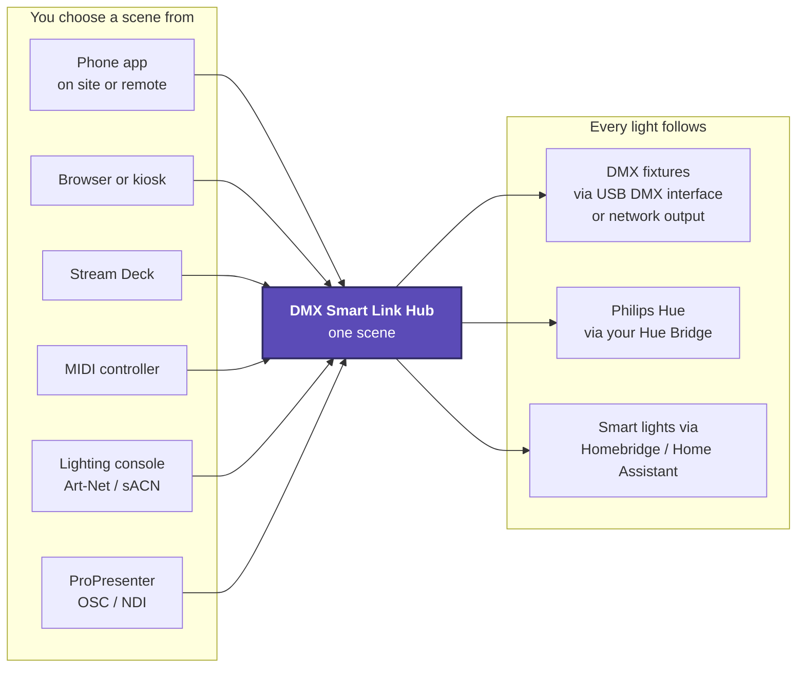
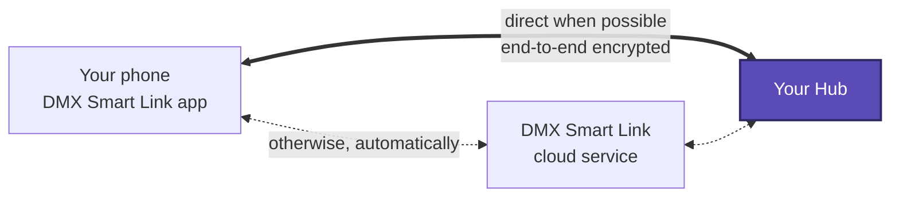

# DMXSmartLink Hub

**Bring DMX fixtures and smart lighting together — from a lighting console, your browser, your phone from anywhere, or an audio-reactive show.**

DMXSmartLink combines visual lighting control, whole-rig scenes, AI Light Shows, presentation/video-driven lighting, MIDI and Stream Deck control, and remote access from the phone app. Use it for churches, theaters, live events, studios, gyms, venues, or smart-home lighting. Choose the capabilities your setup needs and start with a single light.

[Shop and product information](https://dmxsmartlink.com) · [Download Latest](https://github.com/WhiteCrowSecurity/DMXSmartLink/releases/latest) · [Documentation](docs/README.md) · [Video tutorials](https://www.youtube.com/@WhiteCrowSecurity) · [Discord](https://discord.gg/pj6f54dpv7)

## What's new in 2026.10.07.0005

- **Remote access from anywhere:** pair a phone once and run scenes, Visual Control, DMX fixtures and smart lights from any network. Nothing on your router needs changing. End-to-end encrypted, with each phone's key kept in its secure hardware. → [Remote access guide](docs/remote-access.md)
- **Admin and Operator phones:** the first phone becomes the Hub's Admin; add more phones with a one-time code or **QR code**, and remove them at any time from the new **Remote Access** tab.
- **Set up the first phone from the app or the browser:** open the app on the Hub's Wi-Fi, or get a first-phone QR code on the Hub's page. The app checks it is pairing with the right Hub.
- **Homebridge and Home Assistant from the app**, also away from the Hub's network; **Visual Control stays live** remotely; **several phones at once**.
- **Local admin password** for the Remote Access page, with simple ways to reset it.
- **Philips Hue live shows (beta):** real-time Entertainment streaming to a Hue Bridge's entertainment area, 25 updates a second. → [Hue guide](docs/hue-live-shows.md)
- **MIDI Learn, encoders and Blackout:** give any fader, knob or pad its own job; plug a controller straight into a Mac or Windows Hub; a Lighting control card and a first Control Surface view. → [MIDI guide](docs/midi-control.md)
- **Whole-rig backups:** groups, every scene, button order, show selections, custom fixtures and MIDI mappings in one file.
- **18,267 bundled fixture profiles.**

Read the [release notes](RELEASE_NOTES.md) or the [GitHub release](https://github.com/WhiteCrowSecurity/DMXSmartLink/releases/tag/DMXSmartLink-v2026.10.07.0005) for details and limitations.

## One scene, every kind of light



## How remote access connects



Nothing on your router needs changing. The cloud service only passes sealed messages along; it cannot read them. See the [Remote access guide](docs/remote-access.md) for setup, roles and the pairing flow.

## What you can control

| Capability | What it does |
|---|---|
| DMX and smart lights | Control smart lights through **Homebridge and Home Assistant**, and Philips Hue directly through your **Hue Bridge**, alongside patched DMX fixtures. Available controls depend on the device and integration. |
| Remote access | Use the Hub from the DMX Smart Link app on any network, with Admin and Operator phones. See [Remote access](docs/remote-access.md). |
| Console input | Receive Art-Net, sACN, or supported USB DMX input and route it through your configured patch. |
| Fixture output | Control DMX fixtures through supported USB DMX interfaces or network output. USB input and output capabilities depend on the adapter. |
| Visual Control | Arrange your rig on a map; adjust brightness, color, temperature, pan/tilt and fixture-specific controls. |
| Scenes and groups | Save whole-rig scenes, recall only what changes, and organize lights. Overlapping groups must not override an individual light's saved state. |
| AI Light Show | Audio-reactive lighting using selected fixtures/groups and supported audio inputs, including NDI audio. |
| AI Slideshow and NDI video | Drive lighting from images, presentations or a network video source; save reusable setups. |
| Media, Favorites and Follow Spot | Work with media, keep frequent controls handy, and steer supported moving fixtures. |
| Stream Deck and MIDI | Trigger scenes and shows, and learn faders, knobs and pads for fixtures, groups, Master Dimmer and Blackout. See [MIDI controllers](docs/midi-control.md). |
| Philips Hue live shows | Real-time streaming to a Hue Bridge's entertainment area for effects and shows (beta). See [Hue](docs/hue-live-shows.md). |
| Fixture library and CSV import | Find fixture profiles, import supported patch CSVs and check channel mappings against the actual fixture mode. |
| Backup and diagnostics | Export the whole rig to one file and inspect network logs when troubleshooting. |

### Preserve your patch

When one external USB DMX input is intentionally reused across multiple universes, keep the assigned channel ranges non-overlapping across that fanout. Independent network universes are a different case. Do not renumber a working patch just to copy an example.

Smart-light status comes from the configured Homebridge, Home Assistant or Hue provider. A provider's reported state is not an independent measurement of a physical lamp. Ordinary DMX fixtures may have no physical readback.

## Choose your platform

| Platform | Current release |
|---|---|
| Raspberry Pi 5 | ARM64 package; a useful dedicated hub for permanent installations. |
| Ubuntu | x86-64 package for a supported PC or VM. |
| Windows | x64 installer. |
| macOS | Apple silicon package. The current package is not an Intel Mac build. |

For Linux, plan for at least 2 CPU cores and 4 GB RAM, plus free storage for the application, media and updates. A licence (annual or multi-year) is required for licensed lighting operation. Smart-device compatibility depends on your Homebridge plugins, Home Assistant integrations or Hue Bridge; not every consumer bulb exposes every feature.

### Phone apps

| App | Version | How to get it |
|---|---|---|
| iPhone | 1.1 | In App Store review; available now through TestFlight. |
| Android | 1.1.2 | Closed testing: send us a DM on [Discord](https://discord.gg/pj6f54dpv7) to join. |

On the Hub's own network the app finds the Hub automatically. Remote access needs these versions; scanning pairing QR codes needs iPhone 1.1 (build 5) or Android 1.1.2.

## Quick start

1. **Install** the Hub (below) and open `https://<hub-address>:5000` from a browser on the same network.
2. **Activate your licence** in Settings. See [Activate your licence](docs/SOP-ACTIVATE-A-LICENCE.md).
3. **Connect your lights:** patch one DMX fixture in the correct mode, and/or connect Homebridge, Home Assistant or a Philips Hue Bridge.
4. **Test one light** in Visual Control, then **save and recall a scene**.
5. **Pair your phone:** open the DMX Smart Link app on the Hub's Wi-Fi. The first phone becomes the Admin and can then use the Hub from anywhere. See [Remote access](docs/remote-access.md).
6. **Export a backup** once the rig works. See [Back up and restore](docs/SOP-BACKUP-AND-RESTORE.md).

## Install

### Windows and macOS

1. Download the [Windows installer](https://github.com/WhiteCrowSecurity/DMXSmartLink/releases/latest/download/DMXSmartLink-Setup.exe) or [Apple silicon Mac package](https://github.com/WhiteCrowSecurity/DMXSmartLink/releases/latest/download/DMXSmartLink-Installer.pkg).
2. Run the installer and follow its prompts.
3. Open DMXSmartLink. For access from another device on your local network, open `https://<hub-address>:5000`.
4. Enter your licence and configure your smart-light provider in Settings.

### Raspberry Pi 5 and Ubuntu

On a supported 64-bit system, run from the intended user's home directory:

```bash
cd ~ && curl -fsSL https://github.com/WhiteCrowSecurity/DMXSmartLink/releases/latest/download/setup.sh -o setup.sh && sudo bash setup.sh
```

The setup script selects the platform package. Allow installation to finish, then open `https://<hub-address>:5000`. See the [installation guide](docs/SOP-INSTALL.md) for provider setup and troubleshooting.

### Homebridge, Home Assistant and Philips Hue

- **Homebridge:** configure the bundled integration and the relevant vendor plugin, then check the light in Homebridge **Accessories**. Keep the bundled Govee integration version unless the release instructions say otherwise.
- **Home Assistant:** enable its integration in Hub Settings and configure the host, port and access token for your Home Assistant instance. Confirm the light is available in that instance before importing it.
- **Philips Hue:** on the Hub's **Devices** page, press the link button on your Hue Bridge, then select **Pair bridge** and **Import lights**. See [Hue](docs/hue-live-shows.md).
- Refresh the device inventory after provider setup, then test one light before adding the rest of your rig. Never share provider tokens in support posts or screenshots.

## Update an existing hub

1. [Export a backup](docs/SOP-BACKUP-AND-RESTORE.md).
2. Open **Dashboard → Updates** and choose **Stable/Latest**. Beta users can switch back to Stable for this release.
3. Select **Check for Updates**, then **Update Now**. Allow the application to close/restart when required.
4. Confirm the installed version, then test your saved scenes and connected controllers before an event.
5. Pair your phones for remote access: see [Remote access](docs/remote-access.md).

For beta testing, enable **Developer mode** and select **Test (pre-release)**. The release tag shown in the UI identifies the package that channel will install. Keep production rigs on Stable unless you deliberately choose to test a candidate.

If an update fails, retain the updater log and follow the [update guide](docs/SOP-UPDATE-THE-HUB.md). Desktop installers are also available directly from [Latest](https://github.com/WhiteCrowSecurity/DMXSmartLink/releases/latest).

## How-to guides

| I want to… | Guide |
|---|---|
| Install the Hub | [Install](docs/SOP-INSTALL.md) |
| Activate my licence | [Activate your licence](docs/SOP-ACTIVATE-A-LICENCE.md) |
| Control the Hub from my phone, anywhere | [Remote access](docs/remote-access.md) |
| Add or remove a phone | [Remote access](docs/remote-access.md#2-add-more-phones-admin-or-operator) |
| Switch remote access off | [Remote access](docs/remote-access.md#5-switch-remote-access-off-or-back-on) |
| Reset a forgotten admin password | [Remote access](docs/remote-access.md#forgot-the-admin-password) |
| Run fast shows on Philips Hue lights | [Hue live shows](docs/hue-live-shows.md) |
| Map faders, knobs and pads | [MIDI controllers](docs/midi-control.md) |
| Save and recall scenes, saved shows, Stream Deck | [Scenes, shows and controllers](docs/FEATURES.md) |
| Steer a moving head by hand | [Follow Spot](docs/SOP-FOLLOW-SPOT.md) |
| Back up, or move to a new machine | [Back up and restore](docs/SOP-BACKUP-AND-RESTORE.md) |
| Update safely | [Update the Hub](docs/SOP-UPDATE-THE-HUB.md) |

## Validation and known limitations

No release can certify every fixture, provider, controller, phone, network or venue. Remote access and Philips Hue live shows are new: test them with your own phones, network and lights before relying on them at an event.

The intermittent fixture-display flashing report remains under investigation. Check the release notes and test scenes, transitions, brightness and color temperature on your actual hardware before an event.

## Photosensitivity and show safety

Lighting effects can produce flashing and strobing that may trigger seizures or other adverse effects. Validate effects before using them with an audience, provide appropriate warnings, and keep a way to stop output readily available. The hub cannot determine how every physical fixture will respond to its commands.

## Help and support

- [Documentation and operating guides](docs/README.md)
- [YouTube tutorials](https://www.youtube.com/@WhiteCrowSecurity)
- [Discord community](https://discord.gg/pj6f54dpv7)
- Email: **support@dmxsmartlink.com**

When reporting a problem, include the installed version, platform, fixture/device model, provider and steps to reproduce. Remove credentials, pairing codes and private information from logs and screenshots.

This public repository distributes software builds and customer documentation. Application source is maintained privately. Audio-reactive features use audio analysis and project-specific show-control logic.

© White Crow Security / DMXSmartLink
