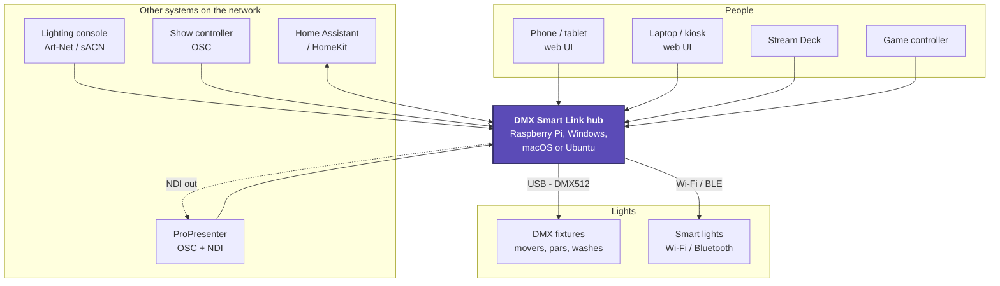
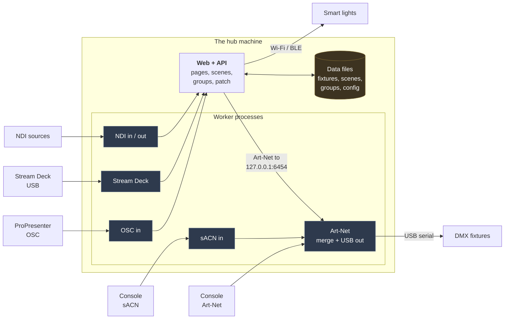
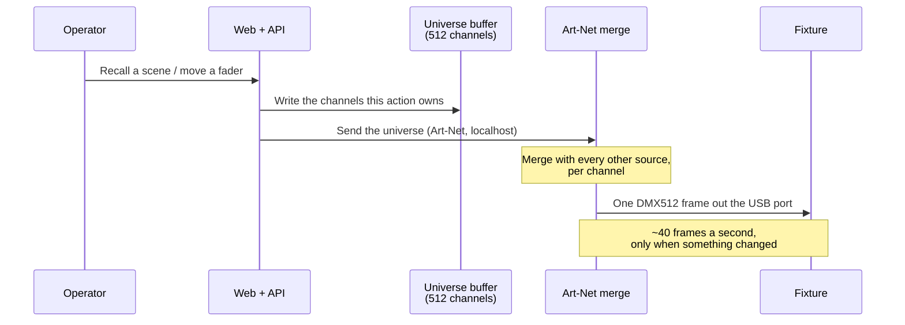
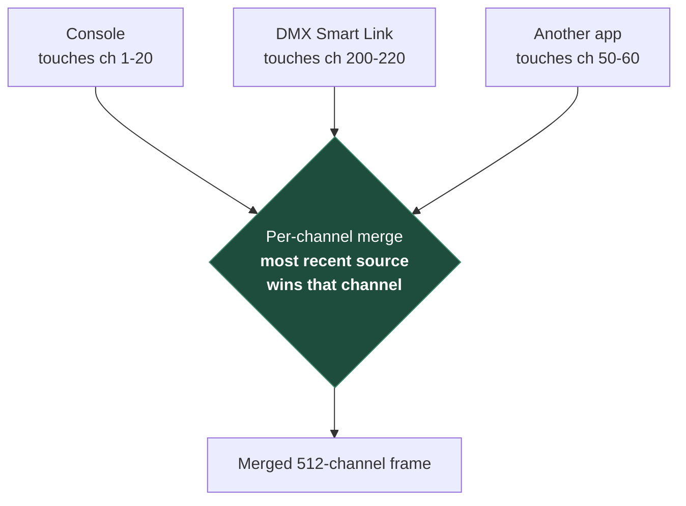
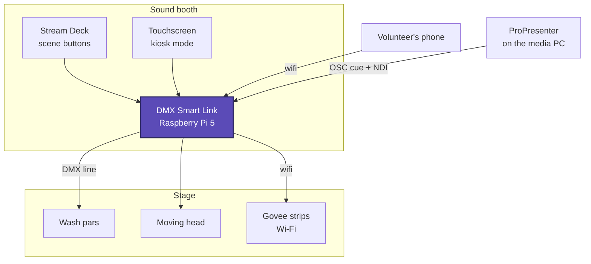
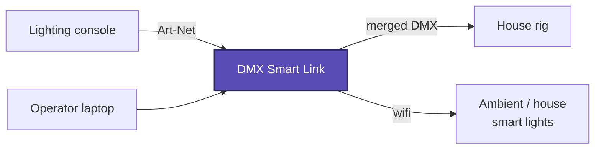
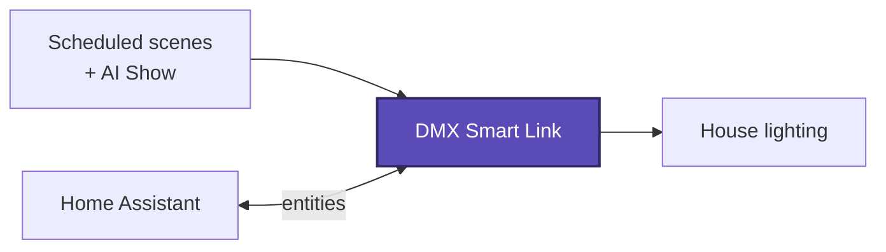
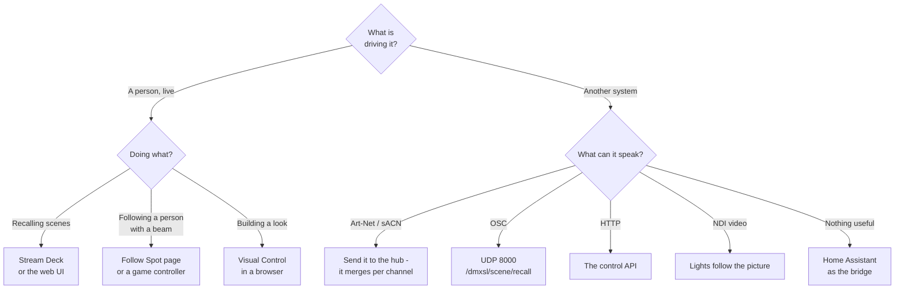
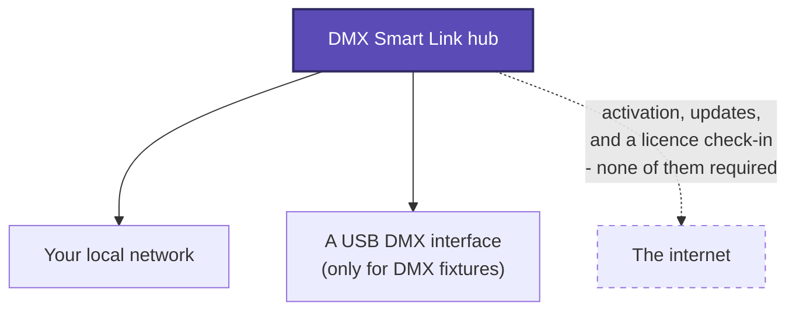

# System architecture

Diagrams of how a DMX Smart Link system fits together, what talks to what, and the ways it is
typically deployed. For integrators, AV consultants, and anyone deciding whether it drops into an
existing rig.

---

## 1. The system at a glance

The hub is one machine on your local network. Everything else reaches it over that network, or
plugs into it.

---

## 2. Inside the hub

Each worker is a **separate process**. A hung Stream Deck or a crash in a native library cannot take
the web interface down with it, and they restart on their own.

There is no database and no cloud account. State is plain JSON files on the hub's disk.

---

## 3. How DMX actually reaches a fixture

### The merge rule

Sources do **not** blank each other's fixtures just by existing. This is what lets the hub sit
alongside equipment you already own rather than replacing it.

---

## 4. Typical deployments

### A church

Scenes on Stream Deck buttons for the volunteer; ProPresenter fires the scene change on a slide; a
phone steers the moving head as a follow spot during the sermon.

### A small venue or studio

The console keeps doing what it does well. The hub adds the smart lights it cannot address, and
merges both onto the one DMX line.

### An install with no operator

---

## 5. Which control path to choose

---

## 6. Ports and protocols

| Direction | Protocol | Port | Used by |
| --- | --- | --- | --- |
| In | HTTPS | 5000 | The web UI and the control API |
| In | Art-Net | UDP 6454 | Consoles, other lighting software |
| In | sACN (E1.31) | UDP 5568 | Consoles, other lighting software |
| In | OSC | UDP 8000 | ProPresenter, QLab, TouchOSC, show controllers |
| In / out | NDI | discovery + dynamic | ProPresenter, OBS, confidence monitors |
| Out | DMX512 | USB serial | The lighting rig |
| Out | Wi-Fi / BLE | — | Smart lights |

All of it is local network. The hub does not require outbound internet to run.

---

## 7. What the hub depends on

The dashed line is the point. Your licence is verified **on your own machine**: the key decides, it
is checked locally, and a hub with no internet runs indefinitely. That is a supported way to use it,
not a workaround.

With internet, the hub also checks in with the licence server every couple of days — that is how a
key used somewhere it should not be is noticed. The check-in is not a gate: if it cannot be made, the
hub keeps running on its valid key, and only an explicit rejection stops it.

---

## See also

- [How it works](HOW-IT-WORKS.md) — the same ground in prose
- [Install](SOP-INSTALL.md) — getting a hub running
- [Follow Spot](SOP-FOLLOW-SPOT.md) — steering a light by hand
- [Back up and restore](SOP-BACKUP-AND-RESTORE.md)
