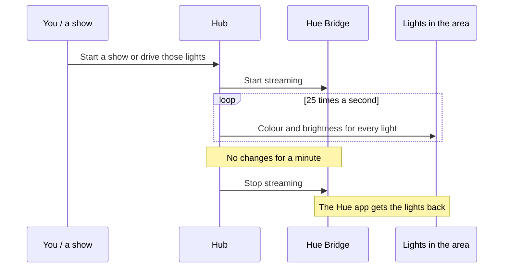

# Philips Hue: pair a Hue Bridge and run live shows (beta)

**Who this is for:** anyone with Philips Hue lights who wants them in Hub scenes, groups and Visual Control,
and in fast effects such as the AI Light Show.

**What you need:**

- A Hub on **2026.10.07.0005** or later, on the same network as your Hue Bridge.
- The Philips Hue app, to create an *entertainment area* (only for live shows).

Live-show streaming is **beta**. Test it with your own lights before an event.

---

## Two ways the Hub drives Hue lights

| | Normal control | Live shows (Entertainment streaming) |
|---|---|---|
| What it is for | Scenes, groups, Visual Control, everyday changes | Effects and shows that change many times a second |
| Speed | About ten commands a second per Hue Bridge | 25 updates a second to every light in the area |
| Which lights | Every light on the Hue Bridge | The lights in one entertainment area per Hue Bridge (up to 20) |
| Set up in | The Hub's **Devices** page | The Hue app (the area) and the Hub's **Devices** page |

The Hue Bridge's other lights keep normal control while an area streams. Each Hue Bridge works on its own,
so a building with several Hue Bridges runs them all at once.

---

## 1. Pair a Hue Bridge

1. In the Hub, open **Devices** and find the **Philips Hue bridges** card.
2. Select **Find bridges**, or type the Hue Bridge's address (for example `192.168.1.50`).
3. **Press the round link button on top of the Hue Bridge**, then select **Pair bridge** within about
   30 seconds.
4. Select **Import lights**. The Hue lights join the device list and can be grouped, put in scenes and
   used in Visual Control like any other light.

> **Paired a Hue Bridge before September 25, 2026?** Pair it again once (press the link button, then
> **Pair bridge**) before using live shows. The card shows **Re-pair this bridge to enable live-show
> streaming** for a Hue Bridge that needs it.

---

## 2. Create an entertainment area (in the Hue app)

1. In the Philips Hue app, go to **Settings → Entertainment areas**.
2. Create an area and add the lights you want in shows (up to 20 per area).
3. Finish the Hue app's setup for the area.

---

## 3. Turn on live shows for that Hue Bridge

1. Back on the Hub's **Devices** page, find the Hue Bridge on the **Philips Hue bridges** card.
2. Next to **Live shows:**, choose the entertainment area you created.
3. The Hub confirms *Live shows on ... now stream to "your area"*.

That is all. Run a show, an effect or a scene as usual:

- Streaming **starts** when the Hub drives the lights in the area, and **stops a minute after** the last
  change, so the Hue app and its schedules get those lights back between shows.
- If streaming fails for any reason, those lights **fall back to normal control on their own**; they are
  never left dark because of a stream problem.

To stop using live shows for a Hue Bridge, set **Live shows:** back to **Off**.

---

## Status at a glance

The card shows the state of each Hue Bridge:

| Status | Meaning |
|---|---|
| **Ready** | An area is chosen; streaming starts when the Hub drives those lights. |
| **Starting stream** / **Streaming to *n* lights** | Live updates are going out now. |
| **Stream problem: ... (using normal control)** | The Hue Bridge refused or the network dropped. Lights are on normal control meanwhile and the Hub retries. |
| **Re-pair this bridge to enable live-show streaming** | Pair the Hue Bridge again (link button, then **Pair bridge**). |
| **This bridge has no entertainment area yet** | Create one in the Hue app first. |

---

## Good to know

- One entertainment area per Hue Bridge is used for live shows at a time.
- While the Hub streams, the Hue app cannot change those lights. Wait a minute after the show, or stop
  the show.
- Hue Bridge pairings are **not** included in a Hub backup, because they contain keys. After restoring onto
  a new machine, pair each Hue Bridge again. See [Back up and restore](SOP-BACKUP-AND-RESTORE.md).
- Remove a Hue Bridge from the Hub with **Remove** next to it on the card.

Report problems with the Hub version, Hue Bridge model and the status text on
[Discord](https://discord.gg/pj6f54dpv7) or to **support@dmxsmartlink.com**.
