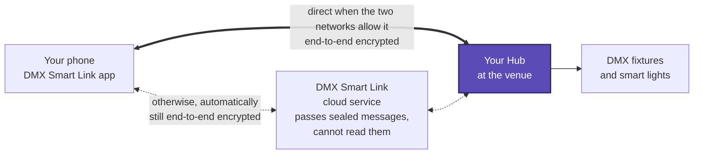
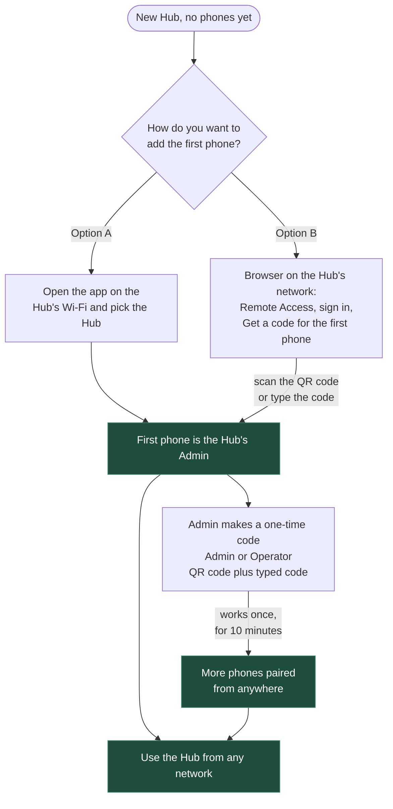

# Remote access: control your Hub from anywhere

**Who this is for:** anyone who wants to run scenes, Visual Control, DMX fixtures and smart lights from the
DMX Smart Link phone app when they are **not** on the Hub's network, for example from home before a service.

**What you need:**

- A Hub on **2026.10.07.0005** or later, activated, with internet access.
- The DMX Smart Link app: **iPhone 1.1** (in App Store review; available now through TestFlight) or
  **Android 1.1.2** (closed testing: send us a DM on [Discord](https://discord.gg/pj6f54dpv7) to join).
  Scanning QR codes needs these versions; typing a code works on every 1.1 version.
- For the first phone: to be on the Hub's own network (same Wi-Fi or LAN).

**Nothing on your router needs changing.** No port forwarding, no VPN, no static public address.

On the Hub's own network nothing changes: the browser and the app keep working exactly as before, with
or without pairing.

---

## How it connects

- The Hub keeps one outgoing connection open to the DMX Smart Link cloud service. That is why nothing
  on your router needs to change.
- When the phone and the Hub can reach each other directly, the app talks to the Hub directly.
  Otherwise the conversation goes through the DMX Smart Link cloud service, which only passes the
  sealed messages along.
- **Everything between the phone and the Hub is encrypted end to end** (P-256 keys, AES-GCM). Every
  phone has its own key, created and kept in the phone's secure hardware. There are no passwords to
  type when you are away, and a phone you remove is cut off immediately.

---

## Who can do what

| | Operator | Admin |
|---|:---:|:---:|
| Scenes, Visual Control, DMX fixtures, smart lights, shows, settings | Yes | Yes |
| Homebridge and Home Assistant tabs (when the Hub runs them) | Yes | Yes |
| Restart the Hub | Yes | Yes |
| Add and remove phones | | Yes |
| Change the local admin password | | Yes |
| Switch remote access (the cloud connection) off and on | | Yes |

A Hub always keeps at least one Admin phone: the last Admin cannot be removed.

---

## The pairing flow at a glance

---

## 1. Set up the first phone (it becomes the Admin)

The first phone paired to a Hub becomes its **Admin**. This step only works on the Hub's own network.
Pick **one** of the two ways.

### Option A: from the app, on the Hub's Wi-Fi

1. Connect the phone to the same network as the Hub.
2. Open the DMX Smart Link app and tap your Hub in the list of discovered Hubs.
3. The app shows **You're the first device**. Choose the Hub's **local admin password** (at least
   8 characters), type it again, and tap **Become Admin**.
4. Done. The app's home screen now shows **Open *your Hub* remotely (Admin)**.

### Option B: from a browser, with a QR code

Use this when you are already at a computer next to the Hub.

1. On a computer or tablet on the Hub's network, open `https://<hub-address>:5000` and choose
   **Remote Access** in the menu.
2. Under **Admin sign-in**, type the local admin password. On a new Hub this is `admin`.
3. If the Hub asks, **choose a new admin password** (at least 8 characters, not `admin`) and select
   **Save password**.
4. Under **Set up the first phone**, optionally type a name for the phone, then select
   **Get a code for the first phone (Admin)**.
5. A **QR code** and a **typed code** appear. On the phone (on the same network):
   - scan the QR code with the phone's camera, or with **Add a HUB with a code → Scan** in the app, or
   - in the app, tap **Add a HUB with a code**, enter the **HUB ID** shown at the top of the Remote Access
     page (in the form `DMX-XXXX-XXXX`) and the code, then tap **Pair this phone**.
6. The app confirms that this phone is the Hub's Admin.

The code works once and expires after 10 minutes. A first-phone code only works on the Hub's own network.
The Hub draws the QR code itself, so this works even if the Hub has no internet at that moment.

> **The app checks it is talking to the right Hub.** Before pairing, the app compares the Hub's identity
> with the one in the code. If they do not match, the app refuses, tells you so, and the code is **not**
> used up, so you can try again on the right network.

---

## 2. Add more phones (Admin or Operator)

You can add phones from the Hub's page or from an Admin phone. The new phone does **not** need to be on
the Hub's network.

### From the Hub's page

1. Open **Remote Access** on the Hub and sign in with the local admin password (on the Hub's network),
   or open the Hub remotely from an Admin phone and tap **Remote Access** in its menu.
2. Under **Add a device**, type a name (for example *Booth Android*), choose **Operator** or **Admin**,
   and select **Get a code**.
3. On the new phone, scan the QR code with the camera or the app, or type the HUB ID and the code under
   **Add a HUB with a code**, then tap **Pair this phone**.

### From an Admin phone

1. On the Admin phone, open the Hub remotely.
2. Tap the **Add a phone** button (the person-with-a-plus icon) at the top.
3. Choose **Admin** or **Operator**. The phone shows a QR code, the typed code and a 10-minute countdown.
4. Scan it with the new phone, or read the code out to the person holding it.

Each code is single-use and expires after 10 minutes. Make a new one for each phone.

---

## 3. Use the Hub remotely

1. Open the DMX Smart Link app anywhere with internet access.
2. Tap **Open *your Hub* remotely**.
3. You get the Hub's own pages, the same as on site: scenes, Visual Control, the DMX patch, smart lights,
   shows and settings.
   - **Visual Control stays live:** changes made in the room appear on your phone within about a second.
   - **Homebridge** and **Home Assistant** tabs appear next to the Hub when the Hub runs them. They open
     their own sign-in pages through the same encrypted connection. The Hub only connects to its own
     Homebridge and Home Assistant.
4. Several phones can be connected at once; one phone loading a large page does not slow the others.
5. If the phone's network drops for a few seconds, the connection recovers on its own. If the app was in
   the background, it reconnects when you return to it; if it cannot, tap **Try again**.

On the Hub's own network you do not need any of this: open the Hub in the app or browser as usual.

---

## 4. Remove a phone

**Lost or replaced phone, or someone leaves the team:**

1. Open **Remote Access** on the Hub as an Admin (signed in on the Hub's network, or from an Admin phone).
2. In the **Devices** list, select **Remove** next to the phone and confirm.

The phone is cut off immediately, including any remote session it has open. The **Activity** list below
shows who added and removed which phone, and when.

**Forget a Hub on your own phone:** in the app's settings, under **Remote access**, tap **Forget** next to
the Hub. This only clears it from that phone; ask an Admin to remove the phone on the Hub as well.

---

## 5. Switch remote access off (or back on)

For an installation that must stay offline:

1. Open **Remote Access** on the Hub as an Admin.
2. Under **Remote access**, clear **Cloud connection**.

The status changes to **Switched off** and the Hub stops its outgoing connection to the DMX Smart Link
cloud service. Paired phones stay on the list but can only reach the Hub on its own network. Tick the box
again to turn remote access back on. The status line shows **Connected** when it is working.

---

## 6. The local admin password

The **Remote Access** page is protected by the Hub's **local admin password**.

- It is only accepted **on the Hub's own network**, never over remote access.
- The default on a new Hub is `admin`, and it must be changed the first time it is used.
- To change it: open **Remote Access** as an Admin, go to **Local admin password**, type the new password
  and select **Change**. An Admin phone can do this remotely.

### Forgot the admin password?

Use whichever of these is easiest:

| Where you are | What to do |
|---|---|
| You have an Admin phone | Open the Hub from that phone, tap **Remote Access**, and set a new password under **Local admin password**. |
| At the Hub's own screen (a Pi with a screen, or a browser on the Windows/Mac computer running the Hub at `https://localhost:5000`) | Open **Remote Access**. Under **Forgot the admin password?** select **Reset admin password** and confirm. |
| Raspberry Pi or Ubuntu Hub, with a terminal | Run `sudo dmxsmartlink reset-admin-password` on the Hub. |

After a reset the password is `admin` again. Sign in and choose a new one straight away.

---

## Troubleshooting

| What you see | What to do |
|---|---|
| **This code does not match that HUB** | You scanned a code from a different Hub, or the phone reached a different machine. Check you are on the right network and try again; the code was not used up. |
| **That code is not valid (it may have expired or been used)** | Codes work once, for 10 minutes. Make a new one. |
| **The first device must be added on the local network** / a first-phone code is refused | Join the Hub's Wi-Fi and try again. |
| The Remote Access page says **Not connected** | Check the Hub has internet access and the Hub's licence is active. Remote access needs the cloud connection ticked. |
| The app shows **Can't reach the HUB** remotely | Check the Hub is powered and online, then tap **Try again**. Make sure the phone was not removed on the Hub. |
| **Wrong password (or too many tries - wait 5 minutes)** | Wait five minutes, then try again, or reset the password as above. |

Remote access is new: please report problems with the Hub version, phone model and app version on
[Discord](https://discord.gg/pj6f54dpv7) or to **support@dmxsmartlink.com**. Never post codes, QR codes or
passwords in a public channel.

---

## Backups and remote access

Phone pairings and the local admin password are **not** part of a backup. They belong to that Hub. After
restoring onto a new machine, set up the first phone again and re-add the others. See
[Back up and restore](SOP-BACKUP-AND-RESTORE.md).
